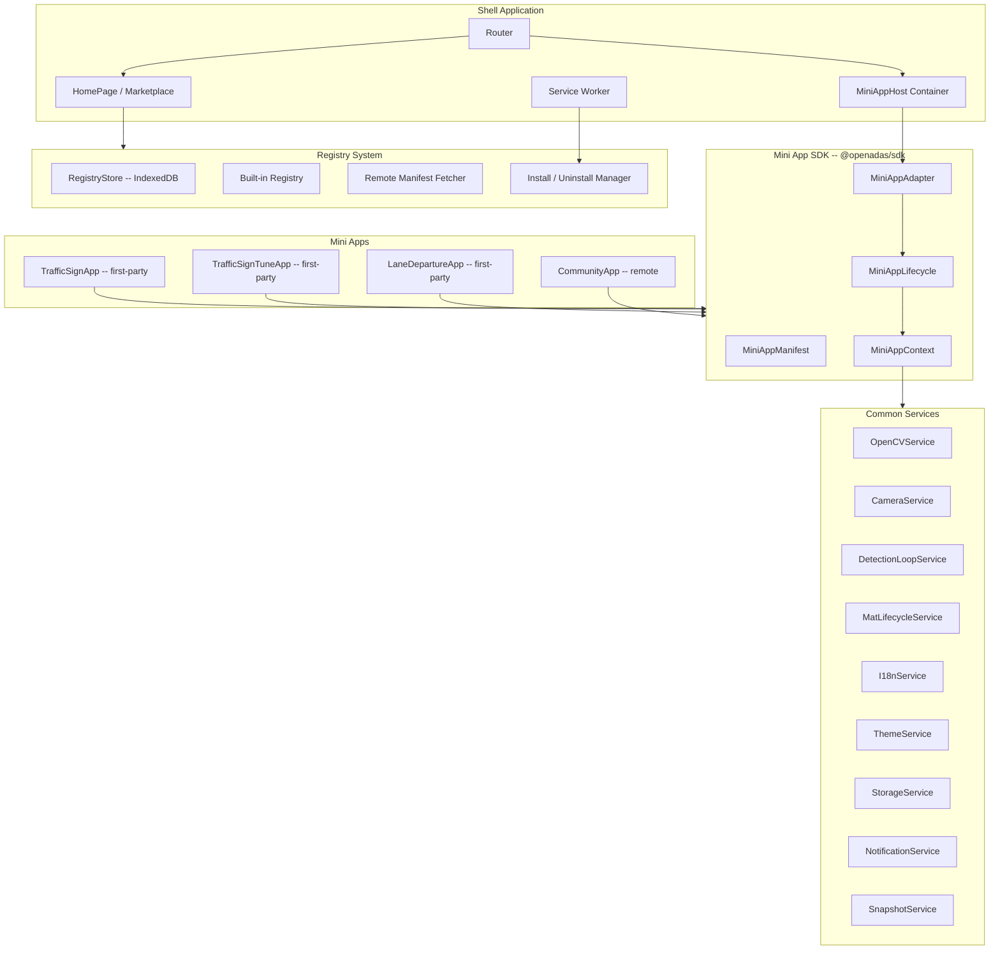
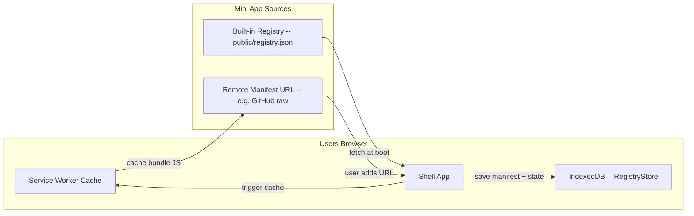

# React + Vite Micro-Frontend Architecture for OpenADAS

## Current State Analysis

The project is a small static site with **no build tools**, consisting of:

- **Root** `index.html` -- mode picker with bilingual (VI/EN) support, light/dark theme
- `**mode/traffic-sign/`** -- production traffic sign detector with pin-based UX
- `**mode/traffic-sign test:tune model/**` -- debug/tuning variant with dual-canvas view
- **OpenCV.js** loaded from CDN, used for classical computer vision (HSV, contours, morphology)
- **No shared CSS or JS files** -- everything is inline in HTML or per-mode `detect.js`

### Duplicate and Reusable Code Identified

The following patterns are **duplicated** across both mode implementations:

- **OpenCV.js load polling** (`waitOpenCV` / `waitForOpenCV`) -- ~6 lines each, both `index.html` files
- **Camera init** (`getUserMedia`, `video.play()`, ready wait) -- ~20 lines each, both `index.html` files
- **HSV preset constants** (`ANCHOR`, `PRESET`) -- ~25 lines each, both `detect.js` files
- **Adaptive HSV threshold calculation** -- ~15 lines each, both `detect.js` files
- **Ring hierarchy detection** (`tryRingHierarchy`) -- ~45 lines each, both `detect.js` files
- **Circle fallback detection** (`tryCircleFallback`) -- ~30 lines each, both `detect.js` files
- **Annulus scoring** (`annulusScore`) -- ~35 lines each, both `detect.js` files
- **Temporal persistence** (history + distance filter) -- ~15 lines each, both `detect.js` files
- **Mat lifecycle management** (alloc/free) -- ~20 lines each, both `detect.js` files
- `**requestAnimationFrame` detection loop** -- ~10 lines each, both `detect.js` files
- **Dark theme base styles** -- ~30 lines each, both mode `index.html` files
- **Status text updates** -- ~5 lines each, both mode `index.html` files

**Estimated ~250+ lines of near-identical code** across only 2 modes. This will compound as more modes are added.

The i18n system (root `index.html`) is a hand-rolled inline `dict` object with DOM `getElementById` updates -- not scalable for mode pages (which are English-only today).

---

## Proposed Architecture: Micro-Frontend Shell

### Core Concept

OpenADAS becomes a **shell application** that hosts **mini apps** (formerly "modes"). The shell provides common services via a well-defined SDK. Mini apps are independently developed, can be first-party (in-repo) or community-contributed (remote), and are installed/managed locally on each user's browser.




### Technology Stack

```
React 19              -- Shell UI framework
Vite 6                -- Build tool, dev server with HMR
React Router 7        -- Shell routing
react-i18next         -- Bilingual i18n (VI/EN)
Tailwind CSS 4        -- Utility-first styling
TypeScript            -- Type safety throughout
vite-plugin-pwa       -- Service Worker generation via Workbox
idb-keyval            -- Lightweight IndexedDB wrapper for registry store
```

### Project Structure

```
openADAS/
├── public/
│   ├── CNAME
│   ├── registry.json                         # Built-in mini app registry manifest
│   └── input/
│       └── test1.mp4
├── src/
│   ├── main.tsx                              # Shell entry point
│   ├── App.tsx                               # Shell router + providers
│   │
│   ├── sdk/                                  # === Mini App SDK ===
│   │   ├── types.ts                          # MiniAppManifest, MiniAppLifecycle, MiniAppContext
│   │   ├── context.ts                        # MiniAppContext builder (assembles services)
│   │   ├── MiniAppAdapter.tsx                # React wrapper: mounts any mini app into a container
│   │   └── index.ts                          # Public SDK barrel export
│   │
│   ├── services/                             # === Common Services ===
│   │   ├── OpenCVService.ts                  # Load OpenCV.js CDN, poll readiness, singleton
│   │   ├── CameraService.ts                  # getUserMedia, enumerate, switch, stop, cleanup
│   │   ├── DetectionLoopService.ts           # rAF loop manager with frame skip + start/stop
│   │   ├── MatLifecycleService.ts            # Track allocated Mats, batch dispose, leak guard
│   │   ├── I18nService.ts                    # Thin wrapper over i18next for SDK consumers
│   │   ├── ThemeService.ts                   # Dark/light mode state + forced dark for mini apps
│   │   ├── StorageService.ts                 # Key-value abstraction over localStorage / IndexedDB
│   │   ├── NotificationService.ts            # Status messages, toast alerts, error display
│   │   ├── SnapshotService.ts                # Canvas snapshot, crop, expand, toDataURL helpers
│   │   └── index.ts                          # Barrel export
│   │
│   ├── registry/                             # === Mini App Registry ===
│   │   ├── types.ts                          # RegistryEntry, InstallState, RemoteManifest
│   │   ├── RegistryStore.ts                  # IndexedDB-backed store (installed apps, preferences)
│   │   ├── builtins.ts                       # Static list of first-party mini app manifests
│   │   ├── RemoteLoader.ts                   # Fetch + validate remote mini app manifests and bundles
│   │   ├── InstallManager.ts                 # Install/uninstall/enable/disable + SW cache triggers
│   │   ├── useRegistry.ts                    # React hook for registry state
│   │   └── index.ts                          # Barrel export
│   │
│   ├── cv/                                   # === Shared CV Engine ===
│   │   ├── types.ts                          # Detection, HSVConfig, UIConfig, ROIConfig
│   │   ├── presets.ts                        # ANCHOR, PRESET constants (deduplicated)
│   │   ├── adaptive.ts                       # adaptiveHSV(), frameStats()
│   │   ├── segmentation.ts                   # Red HSV dual-band masking pipeline
│   │   ├── ring-detection.ts                 # ringHierarchy() + circleFallback()
│   │   ├── annulus.ts                        # annulusScore()
│   │   ├── persistence.ts                    # Temporal filtering (N-of-M frames)
│   │   └── RedRingDetector.ts                # Unified detector (replaces 2 detect.js files)
│   │
│   ├── hooks/                                # === Shell React Hooks ===
│   │   ├── useOpenCV.ts                      # Hook wrapping OpenCVService
│   │   ├── useCamera.ts                      # Hook wrapping CameraService
│   │   ├── useDetectionLoop.ts               # Hook wrapping DetectionLoopService
│   │   └── useMatLifecycle.ts                # Hook wrapping MatLifecycleService
│   │
│   ├── components/                           # === Shell UI Components ===
│   │   ├── layout/
│   │   │   ├── AppShell.tsx                  # Top-level layout (nav, safe areas)
│   │   │   └── SafeArea.tsx                  # env(safe-area-inset) wrapper
│   │   ├── common/
│   │   │   ├── LangToggle.tsx                # VI/EN toggle button
│   │   │   ├── StatusBar.tsx                 # Status text display
│   │   │   ├── CameraSelect.tsx              # Camera device picker
│   │   │   └── VideoCanvas.tsx               # Video + overlay canvas pair
│   │   ├── detection/
│   │   │   ├── DetectionView.tsx             # Video + canvas + bounding box overlay
│   │   │   ├── PinCard.tsx                   # Individual pinned detection card
│   │   │   ├── PinList.tsx                   # Scrollable pin list (max N)
│   │   │   └── DebugMask.tsx                 # Binary mask canvas (for tune modes)
│   │   ├── settings/
│   │   │   ├── SettingsPanel.tsx             # Slide-out glassmorphism panel
│   │   │   └── ModeSelector.tsx              # Day/Night + tightness dropdowns
│   │   ├── marketplace/
│   │   │   ├── AppCard.tsx                   # Mini app card (icon, name, install button)
│   │   │   ├── AppGrid.tsx                   # Grid of available/installed apps
│   │   │   └── InstallButton.tsx             # Install/uninstall toggle with progress
│   │   └── host/
│   │       └── MiniAppHost.tsx               # Container that mounts a mini app via adapter
│   │
│   ├── pages/
│   │   ├── HomePage.tsx                      # Installed mini apps grid + marketplace link
│   │   ├── MarketplacePage.tsx               # Browse/install/remove mini apps
│   │   └── MiniAppPage.tsx                   # Dynamic route: loads + mounts any mini app
│   │
│   ├── mini-apps/                            # === First-Party Mini Apps (in-repo) ===
│   │   ├── traffic-sign/
│   │   │   ├── manifest.ts                   # MiniAppManifest for traffic sign detection
│   │   │   ├── TrafficSignApp.tsx            # Production app component
│   │   │   └── index.ts                      # Exports MiniAppLifecycle implementation
│   │   ├── traffic-sign-tune/
│   │   │   ├── manifest.ts                   # MiniAppManifest for tune/debug mode
│   │   │   ├── TrafficSignTuneApp.tsx        # Debug app component
│   │   │   └── index.ts                      # Exports MiniAppLifecycle implementation
│   │   ├── lane-departure/
│   │   │   ├── manifest.ts                   # Placeholder manifest
│   │   │   └── index.ts                      # Placeholder lifecycle
│   │   └── combo/
│   │       ├── manifest.ts                   # Placeholder manifest
│   │       └── index.ts                      # Placeholder lifecycle
│   │
│   ├── sw/
│   │   └── sw-custom.ts                      # Custom Service Worker logic (mini app cache mgmt)
│   │
│   ├── i18n/
│   │   ├── index.ts                          # i18next config
│   │   ├── vi.json                           # Vietnamese translations
│   │   └── en.json                           # English translations
│   │
│   └── utils/
│       ├── snapshot.ts                       # Canvas snapshot + crop helpers
│       └── geometry.ts                       # expandRect, unionRects, rectFromCircle
│
├── index.html                                # Vite entry HTML
├── vite.config.ts
├── tailwind.config.ts
├── tsconfig.json
├── package.json
└── README.md
```

---

## Mini App SDK Design

### MiniAppManifest

Every mini app (first-party or remote) declares a manifest:

```typescript
type LocalizedString = Partial<Record<LangCode, string>> & { en: string }; // en required as fallback

interface MiniAppManifest {
  id: string;                          // unique, e.g. "traffic-sign", "com.someone.lane-assist"
  name: LocalizedString;               // { en: "Traffic Sign Recognition", vi: "Nhan dien bien bao" }
  description: LocalizedString;        // en required, other languages optional
  version: string;                     // semver
  icon: string;                        // emoji or URL to icon
  accentColor: string;                 // hex color for card accent
  author: string;
  homepage?: string;                   // link to docs/repo
  entryUrl?: string;                   // for remote apps: URL to the ES module bundle
  tags?: string[];                     // ["detection", "signs", "safety"]
  permissions?: MiniAppPermission[];   // ["camera", "opencv", "storage"]
  minShellVersion?: string;            // minimum compatible shell version
}

type MiniAppPermission = "camera" | "opencv" | "storage" | "notifications";
```

### MiniAppLifecycle -- Framework-Agnostic Contract

Mini apps implement this interface. The shell calls these methods. This is **framework-agnostic** -- a community mini app can use vanilla JS, React, Vue, Svelte, or anything that renders to a DOM node.

```typescript
interface MiniAppLifecycle {
  manifest: MiniAppManifest;

  mount(container: HTMLElement, context: MiniAppContext): void | Promise<void>;
  unmount(): void | Promise<void>;

  onPause?(): void;     // called when user navigates away but app stays cached
  onResume?(): void;    // called when user navigates back
}
```

### MiniAppContext -- Services Injected by Shell

When the shell mounts a mini app, it injects a `MiniAppContext` providing access to all common services. Mini apps **never** access browser APIs directly for camera/OpenCV -- they go through the context. This ensures proper lifecycle management and resource sharing.

```typescript
interface MiniAppContext {
  // --- Core CV Services ---
  opencv: {
    ready: boolean;
    onReady(cb: () => void): () => void;   // returns unsubscribe
    cv: typeof cv;                          // reference to window.cv when ready
  };
  camera: {
    requestStream(constraints?: MediaStreamConstraints): Promise<MediaStream>;
    listDevices(): Promise<MediaDeviceInfo[]>;
    stopStream(): void;
    currentStream: MediaStream | null;
  };
  detectionLoop: {
    start(callback: (timestamp: number) => void, frameSkip?: number): void;
    stop(): void;
    running: boolean;
  };
  matLifecycle: {
    track(mat: any): void;          // register a Mat for auto-cleanup
    disposeAll(): void;             // manually dispose all tracked Mats
  };

  // --- UI Services ---
  i18n: {
    LANG: typeof LANG;                  // extensible language codes dictionary
    supportedLanguages: LangCode[];     // e.g. ["vi", "en"] -- derived from LANG at runtime
    t(key: string, options?: object): string;
    language: LangCode;
    changeLanguage(lang: LangCode): Promise<void>;
  };
  theme: {
    mode: "light" | "dark";
    forceDark(): void;              // mini apps in driving context force dark
    restoreAuto(): void;
  };
  notifications: {
    status(message: string): void;
    toast(message: string, type?: "info" | "warning" | "error"): void;
  };

  // --- Data Services ---
  storage: {
    get<T>(key: string): Promise<T | undefined>;
    set<T>(key: string, value: T): Promise<void>;
    remove(key: string): Promise<void>;
  };
  snapshot: {
    capture(video: HTMLVideoElement, scale?: number): HTMLCanvasElement | null;
    crop(canvas: HTMLCanvasElement, rect: Rect): string;  // returns data URL
    expandRect(rect: Rect, frameW: number, frameH: number, padX?: number, padY?: number): Rect;
  };
}
```

### MiniAppAdapter -- React Wrapper

For first-party React mini apps, a thin adapter connects the lifecycle contract to React:

```typescript
function MiniAppAdapter({ lifecycle, context }: {
  lifecycle: MiniAppLifecycle;
  context: MiniAppContext;
}): JSX.Element;
```

The adapter creates a `<div ref>`, calls `lifecycle.mount(div, context)` on mount, `lifecycle.unmount()` on cleanup, and forwards pause/resume on route changes.

For first-party React mini apps, a convenience helper wraps a React component into a `MiniAppLifecycle`:

```typescript
function createReactMiniApp(
  manifest: MiniAppManifest,
  Component: React.ComponentType<{ context: MiniAppContext }>
): MiniAppLifecycle;
```

This calls `createRoot(container).render(<Component context={context} />)` in `mount()` and `root.unmount()` in `unmount()`.

---

## Common Services -- Extracted from Duplicate Code

Each service is a plain TypeScript class (not React-specific) so it can be consumed by both React hooks inside the shell and by framework-agnostic mini apps via `MiniAppContext`.

### OpenCVService

**Replaces:** `waitOpenCV()` / `waitForOpenCV()` in both `index.html` files.

Singleton that injects the CDN `<script>`, polls `window.cv && cv.Mat`, and resolves. Exposes `ready`, `onReady(cb)`, and the `cv` namespace reference. The Service Worker precaches `opencv.js` so subsequent loads are instant.

### CameraService

**Replaces:** `getUserMedia`, `enumerateDevices`, `video.play()`, `waitVideoReady()`, stream stop/switch in both `index.html` files.

Manages a single active `MediaStream`. Handles permission errors, device enumeration, switching cameras, and cleanup. Ensures `video.width`/`video.height` sync with `videoWidth`/`videoHeight` (the OpenCV size-mismatch bug).

### DetectionLoopService

**Replaces:** `requestAnimationFrame` loop + `frameSkip` counter in both `detect.js` files.

Generic rAF manager that calls a user-provided callback at the configured frame skip rate. Start/stop/pause with proper cleanup.

### MatLifecycleService

**Replaces:** `free()` / `freeMats()` + per-frame temp Mat `delete()` in both `detect.js` files.

Tracks all OpenCV Mats allocated during a session. Auto-disposes on stop or error. Prevents the memory leaks that are the primary risk with OpenCV.js.

### I18nService

**Replaces:** Inline `dict` object + manual DOM updates in root `index.html`.

Thin wrapper exposing `t()`, `language`, and `changeLanguage()` from the shell's `react-i18next` instance. Mini apps receive this via context and can register their own translation namespaces.

Exports an extensible `LANG` constant dictionary and derived types. Adding a new language is a single-line addition to `LANG` -- every type, validation, and UI element that depends on it updates automatically:

```typescript
// src/services/I18nService.ts (or src/i18n/languages.ts)

const LANG = {
  VI: "vi",
  EN: "en",
  // To add a language, just add a line here + a matching JSON file in src/i18n/
  // JA: "ja",
  // KO: "ko",
  // ZH: "zh",
} as const;

type LangCode = typeof LANG[keyof typeof LANG];  // union: "vi" | "en" | ...
const SUPPORTED_LANGUAGES: LangCode[] = Object.values(LANG);
const DEFAULT_LANG: LangCode = LANG.EN;

function detectLanguage(): LangCode {
  const stored = localStorage.getItem("openadas_lang") as LangCode | null;
  if (stored && SUPPORTED_LANGUAGES.includes(stored)) return stored;
  const browserLang = navigator.language.split("-")[0];
  return SUPPORTED_LANGUAGES.includes(browserLang as LangCode)
    ? (browserLang as LangCode)
    : DEFAULT_LANG;
}
```

All code that references language codes (auto-detection, localStorage, `changeLanguage()`, manifest keys, LangToggle UI) uses `LANG.*` constants and `LangCode` type instead of raw strings. The `LangToggle` component iterates `SUPPORTED_LANGUAGES` to render options, so it automatically shows new languages without code changes.

Mini app manifests use `Partial<Record<LangCode, string>>` for `name` and `description`, allowing graceful fallback to `LANG.EN` when a translation is missing.

### ThemeService

**Replaces:** `prefers-color-scheme` media queries (home) + forced dark CSS (mode pages).

Provides `mode` (light/dark), `forceDark()` for driving context, and `restoreAuto()` when returning to home. Mini apps call `context.theme.forceDark()` on mount.

### StorageService

**Replaces:** `localStorage.getItem("openadas_lang")` and any future per-mini-app preferences.

Namespaced key-value store. Shell uses it for language preference and registry state. Each mini app gets a scoped `storage` (keys prefixed with app ID) so apps cannot collide.

### NotificationService

**Replaces:** `statusEl.textContent = "..."` in both mode `index.html` files.

Centralized status bar + toast system. Mini apps call `context.notifications.status("Loading OpenCV...")` or `context.notifications.toast("Detection started", "info")`.

### SnapshotService

**Replaces:** `snapshotCanvas()`, `cropToDataURL()`, `expandRect()`, `unionRects()` in [mode/traffic-sign/index.html](mode/traffic-sign/index.html).

Pure utility for capturing video frames to canvas (with downscale), cropping regions, and producing data URLs for pin cards or other UX.

---

## Registry and Installation System

### Architecture




### RegistryStore (IndexedDB via `idb-keyval`)

Stores the authoritative list of mini apps known to this browser:

```typescript
interface RegistryEntry {
  manifest: MiniAppManifest;
  source: "builtin" | "remote";
  sourceUrl?: string;              // for remote: the manifest URL
  state: "installed" | "available" | "disabled";
  installedAt?: number;            // timestamp
  cachedVersion?: string;          // version currently in SW cache
}
```

### Built-in Registry (`public/registry.json` + `src/registry/builtins.ts`)

First-party mini apps are listed in a static JSON file and also registered in code via `builtins.ts`. On first boot, the shell seeds the IndexedDB store from this list, marking all built-in apps as `installed`.

### Remote Mini App Loading

Community mini apps are hosted externally (e.g., their own GitHub Pages). To add one, a user enters the manifest URL in the Marketplace page. The flow:

1. Shell fetches the remote manifest JSON and validates it against `MiniAppManifest` schema
2. User confirms installation (sees name, author, permissions)
3. `InstallManager` saves the `RegistryEntry` to IndexedDB with `state: "installed"`
4. `InstallManager` tells the Service Worker to cache the mini app's `entryUrl` bundle
5. On next load, the mini app appears on the HomePage grid
6. When launched, the shell dynamically imports the cached bundle: `const mod = await import(manifest.entryUrl)`
7. The module must export a `MiniAppLifecycle` (or at minimum `mount` + `unmount` + `manifest`)

### Service Worker Caching Strategy

Using `vite-plugin-pwa` with Workbox:

- **Precache:** Shell app assets (HTML, JS, CSS) + `opencv.js` CDN (via Workbox external URL)
- **Runtime cache -- "mini-app-bundles":** `NetworkFirst` strategy for remote mini app entry URLs. On install, the `InstallManager` calls `sw.postMessage({ type: "CACHE_MINI_APP", url })` to eagerly cache the bundle. On uninstall, it sends `EVICT_MINI_APP`.
- **Offline fallback:** If network is unavailable and bundle is cached, the mini app loads from cache. If not cached, the Marketplace shows "offline -- not available".

### Security Constraints for Remote Mini Apps

- Remote mini apps execute in the **same origin** (they are ES modules loaded via dynamic import). This is acceptable because:
  - The user explicitly installs them (informed consent)
  - Mini apps access hardware (camera) only through the `MiniAppContext` services, not directly
  - The shell can revoke services at any time (unmount)
- Future hardening: run remote mini apps in a sandboxed `<iframe>` with `postMessage` bridge to the SDK (opt-in, not in v1)

---

## Unified RedRingDetector (merges 2 detect.js files)

The two `detect.js` files share ~80% logic but diverge in:

- Production: ROI cropping, `onStable` callback, frame skip, cached stats, `free()` recovery
- Tune: `maskCanvas` output, auto profile selection, `putText` labels, full-frame

**Solution:** Single `RedRingDetector` class in `src/cv/RedRingDetector.ts` with configuration flags:

```typescript
interface DetectorConfig {
  video: HTMLVideoElement;
  outputCanvas: HTMLCanvasElement;
  maskCanvas?: HTMLCanvasElement;        // optional -- enables debug mask
  roi?: { topFraction: number; heightFraction: number }; // optional ROI
  frameSkip?: number;                    // 0 = every frame
  statsEveryN?: number;                  // 1 = every frame
  getUIConfig: () => UIConfig;
  onStable?: (detections: Detection[]) => void;
  debug?: boolean;
  drawLabels?: boolean;                  // "TRAFFIC SIGN" text on detections
}
```

All shared CV logic (presets, adaptive HSV, ring detection, annulus, persistence) lives in `src/cv/` as **pure functions** importable by any future detector module or community mini app.

---

## Routing

- `/` -- `HomePage` -- Grid of installed mini apps + link to marketplace
- `/marketplace` -- `MarketplacePage` -- Browse available apps, install/remove, add remote URL
- `/app/:appId` -- `MiniAppPage` -- Dynamic: resolves appId from registry, loads + mounts mini app
- `/app/:appId/tune` -- `MiniAppPage` -- Same loader, appId = "traffic-sign-tune" etc.

No more hardcoded routes per mode. The `MiniAppPage` is a **single dynamic route** that:

1. Looks up `appId` in `RegistryStore`
2. For built-in apps: lazy-imports from `src/mini-apps/{appId}/index.ts`
3. For remote apps: dynamic-imports from the cached `entryUrl`
4. Wraps in `MiniAppAdapter`, injects `MiniAppContext`

---

## Feature Parity Checklist

Every feature in the current codebase is preserved:

- Mode picker home page with card grid (now shows installed mini apps)
- Light/dark auto theme on home page
- VI/EN language toggle with localStorage persistence
- Bilingual intro text, mode titles, descriptions, footer
- Traffic sign detection -- production mode (now a first-party mini app):
  - OpenCV.js loading with status display (via OpenCVService)
  - Camera permission request + device selector (via CameraService)
  - Day/Night HSV profile selector
  - MENU toggle to start/stop detection
  - Live video preview when paused, canvas output when running
  - Green bounding box overlay on detected signs
  - Pin system: track, cluster window, snapshot, crop, pin card (via SnapshotService)
  - Pin time display ("Xs ago") with live update
  - Max 5 pins, oldest removed
  - Glassmorphism UI panels
- Traffic sign detection -- debug/tune mode (now a separate first-party mini app):
  - Dual canvas: detection output + binary mask
  - Profile selector (Auto/Day/Night)
  - Tightness selector (Loose/Med/Tight/Ultra)
  - "TRAFFIC SIGN" text label on detected signs
- Fullscreen dark driving UI for mini app pages (via ThemeService.forceDark)
- Safe area inset handling for notch devices
- Footer with GitHub + feedback links
- CNAME for `beta.openadas.io.vn`
- Placeholder mini apps for lane-departure and combo modes

**New capabilities:**

- Marketplace page to browse and install/remove mini apps
- Remote community mini app support via URL
- Offline support via Service Worker caching
- Scoped per-app storage
- Centralized notification/status system

---

## Migration Strategy

The migration should be done incrementally in this order:

1. **Scaffold** -- Vite + React + TypeScript + Tailwind + PWA plugin project setup
2. **Mini App SDK** -- Define `MiniAppManifest`, `MiniAppLifecycle`, `MiniAppContext` types and the `MiniAppAdapter` component
3. **Common Services** -- Build all 9 services as plain TS classes, wire into `MiniAppContext` builder
4. **Registry System** -- `RegistryStore` (IndexedDB), built-in registry, remote loader, install manager, `useRegistry` hook
5. **Service Worker** -- Configure Workbox precaching + runtime mini app bundle caching + custom message handlers
6. **CV Engine** -- Extract and deduplicate detection logic into `src/cv/` modules
7. **Shell Components** -- Build shell layout, common components, marketplace UI, and `MiniAppHost`
8. **First-Party Mini Apps** -- Port traffic-sign (production + tune) as mini apps with manifests; create placeholder mini apps for lane-departure and combo
9. **Pages + Routing** -- Build `HomePage`, `MarketplacePage`, `MiniAppPage` (dynamic loader), wire React Router
10. **i18n** -- Extract translations, wire `react-i18next`, expose `I18nService` to mini apps
11. **Styling** -- Port all inline CSS to Tailwind, verify themes
12. **Deploy** -- GitHub Pages setup with CNAME, 404.html fallback, GitHub Actions CI/CD

